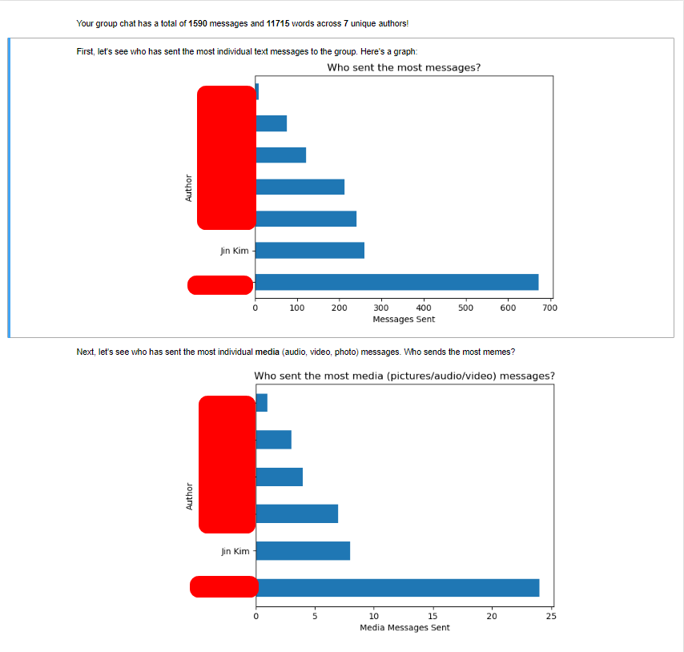

# WhatsApp Chatlog Analyser

A data analysis exercise using Python, Pandas, Matplotlib and Jupyter notebook. Takes in WhatsApp chatlogs and generates informative graphs and tables
about your friends' messaging patterns.

## Used:

* Python. Important modules: Pandas, Matplotlib, Tkinter
* Jupyter Notebook & nbconvert for exporting to .html
* Regular Expressions for pattern matching during creation of .csv dataframe

## Features

* Converts WhatsApp chat logs into a clean, efficient .csv dataframe for data analysis work
* Creates and stores .csv tables & .png figures in program directory for individual access
* Creates an .ipynb file with data analysis performed about messaging habits, and exports it to .html for ease of access

## Demo

## Instructions for Usage

1. Ensure that you have Python 3 and the appropriate libraries (found in requirements.txt) installed.
2. In the WhatsApp app, navigate to the desired group chat -> Settings -> Export Chat -> No image. Copy this .txt file to your computer.
3. Run .start bat in the program directory.
4. When prompted, select the .txt chat log.

You can find the .html file and .ipynb file in the output_final folder. As well, you can find the tables and figures created in the images folder. If you are interested in doing further work on your own, the .csv dataframe can be found in the csv_output folder.
